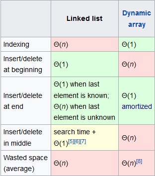

## Сравнение производительности ArrayList / LinkedList

Прежде чем писать бенчмарки определимся с методикой:

- прогон на небольшом объеме данных (чтобы помещался в кэш), для определения baseline
- далее смотрим как деградирует производительность на объемах в k-раз больших, а точнее проверим, что на операциях занимающих О(1), throughput остается на прежнем уровне, а при сложности О(n) по аналогии производительность должна просесть в k-раз

## Что ожидаем

Приведем сравнительную таблицу временной сложности алгоритмов для рассматриваемых структур данных


По ней видно, что стоимость операций противоположная: где выигрывает связный список - там проигрывает динамический массив и наоборот. Также можно заметить, что существует реализация связного списка с запоминанием последнего узла, что значительно облегчает вставку в конец.

Наметим план замеров.

1. Вставка/удаление в начало списка. Тут ожидаем, что linked list покажет большую производительность, а в случае с array list стоит проверить как влияет резервирование capacity. Интуитивно ожидаем прирост, т.к. исключается операция grow
2. Вставка/удаление в конец списка. Для дин. массива это операция выполняется за амортизированное O(1), чтобы замерить худший случай сделаем тест в котором установим значение capacity так чтобы всегда происходил resize массива. Для linked-list сложность будет "честным" O(1) благодаря запоминанию последнего узла
3. Увеличим объем данных, допустим в 50 раз и снова проверим время вставки в начало списков. Для linked list - измениться оно не должно, а для array list производительность упадет в ~50 раз, разумеется будет определенная погрешность
4. Вставка в конец списка на большем объеме данных не должно существенно менять расклад, кроме худшего случая для array list, в котором производительность линейно упадет

Теперь проверим расходится ли теория с практикой.

## Запуск

Собираем и запускаем проект
```
$ ./run-benchmark.bat
```

Вот какие получены результаты
```
# Run complete. Total time: 00:15:24

Benchmark                                                                         Mode  Cnt         Score         Error Units
InsertAtBeginning100Benchmark.arrayListInsertAtBeginningWithInitialCapacity      thrpt   50  47648048,152 ?  240974,683 ops/s
InsertAtBeginning100Benchmark.arrayListInsertAtBeginningWithoutInitialCapacity   thrpt   50  11478935,188 ?  207665,468 ops/s
InsertAtBeginning100Benchmark.linkedListInsertAtBeginning                        thrpt   50  72126546,838 ? 3072537,138 ops/s

InsertAtEnding100Benchmark.arrayListInsertAtEndingWithReservedCapacity           thrpt   50  85115570,257 ? 1521218,557 ops/s
InsertAtEnding100Benchmark.arrayListInsertAtEndingWithWastedCapacity             thrpt   50  21211767,751 ? 1327048,400 ops/s
InsertAtEnding100Benchmark.linkedListInsertAtEnding                              thrpt   50  82734650,147 ?  771455,085 ops/s

InsertAtBeginning5000Benchmark.arrayListInsertAtBeginningWithInitialCapacity     thrpt   50   2579099,006 ?   13880,692 ops/s
InsertAtBeginning5000Benchmark.arrayListInsertAtBeginningWithoutInitialCapacity  thrpt   50    318881,873 ?    7370,118 ops/s
InsertAtBeginning5000Benchmark.linkedListInsertAtBeginning                       thrpt   50  47830631,300 ? 1878014,009 ops/s

InsertAtEnding5000Benchmark.arrayListInsertAtEndingWithReservedCapacity          thrpt   50  68800395,142 ? 1832519,612 ops/s
InsertAtEnding5000Benchmark.arrayListInsertAtEndingWithWastedCapacity            thrpt   50    370680,239 ?   18711,106 ops/s
InsertAtEnding5000Benchmark.linkedListInsertAtEnding                             thrpt   50  41915758,478 ? 4166009,769 ops/s
```

## Анализ

1. Результат вполне соответствует ожидаемому: linked list показывает до 7 раз большую производительность против худшего случая array list и в 1,5 раза в среднем. Разница между средним и худшим вариантом до 4 раз, но особых опасений это не вызывает - resize происходит не так уж часто.
2. Вставка в конец array list быстрее чем в linked в среднем на 5%. И для него снова получаем разницу в 4 раза между средним и худшим случаем.
3. При увеличении объема результат не совсем совпадает с предсказанным, но это известная проблема микробенчмарков, т.к. сложно достичь идеальной изоляции тестов, например время затрачиваемое на подготовку тестовых данных накладывается на результаты теста и вносит искажения, так же как параллельно запущенные процессы, сама ОС и т.д. Но порядки величин у нас совпадают: вставка в начало связного списка осталась почти на прежнем уровне, для array list в среднем упало до 35 раз, что даже лучше расчетных ~50.
4. С последним тест-кейсом аналогичо: время вставки в начало/конец связного списка примерно совпадает, так же как и худший случай у динамического массива, что ожидаемо, ибо в этих случаях выполняется симметричный код. Вставка в конец array list подтвеждает амортизированное O(1).

## Вывод

Какого-либо откровения в результатах нет, результат вполне согласуется с теорией.
Что мы можем из этого извлечь?

- При интенсивной вставке в произвольные позиции лучше использовать связный список
- Для array list полезно указывать адекватную capacity
- Если учесть предыдущий пункт, то вставка в конец array list действительно самая производительная операция
- Мы не тестировали memory footprint но очевидно, что array list хранится более компактно

## Окружение

- Windows 7 x64
- Java HotSpot(TM) 64-Bit Server VM (build 25.45-b02, mixed mode)
- Intel core i7 4770
